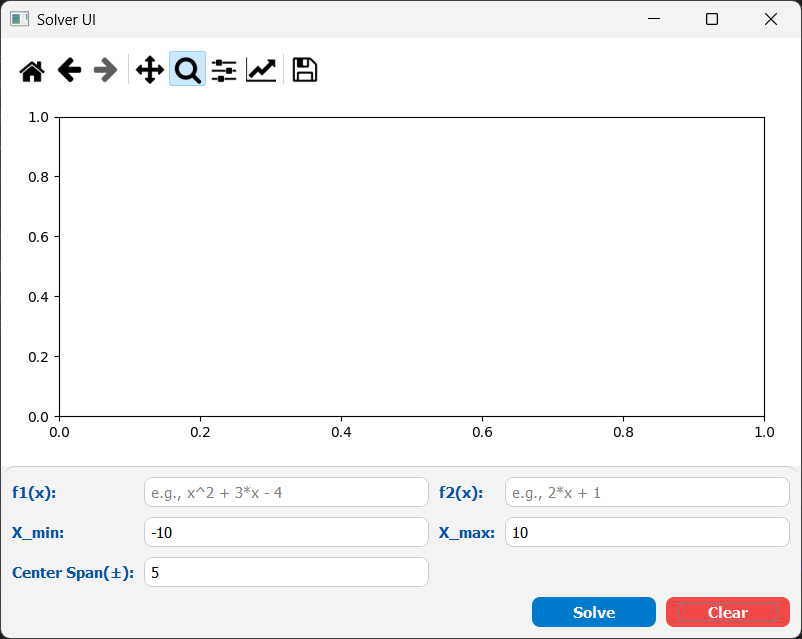
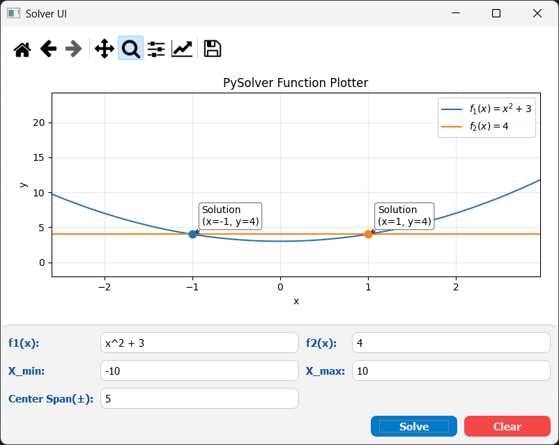
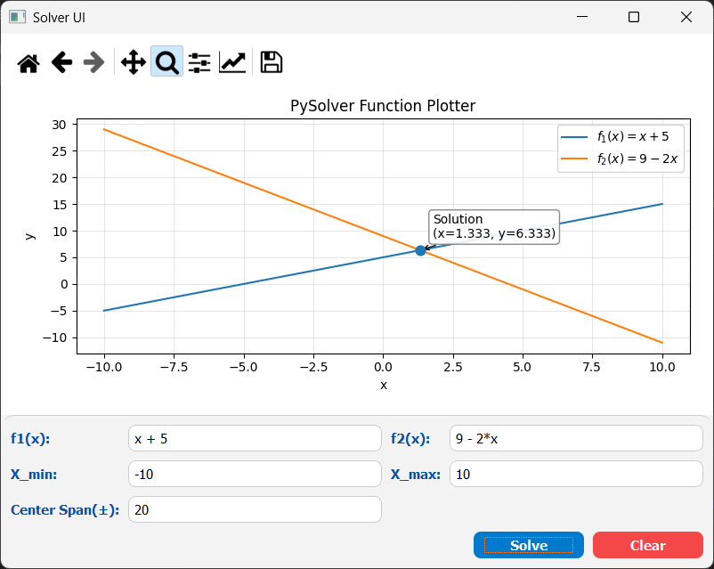
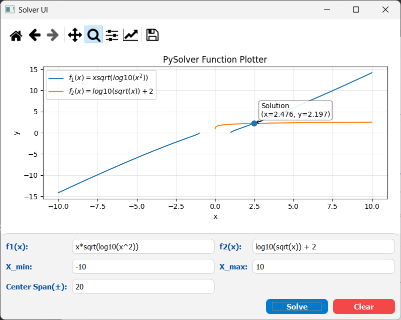
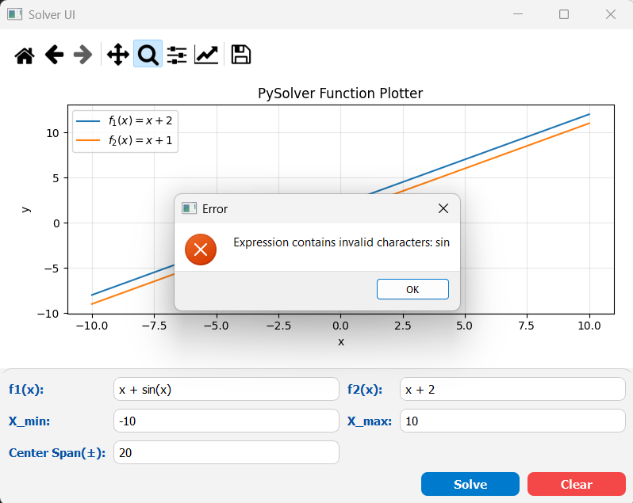
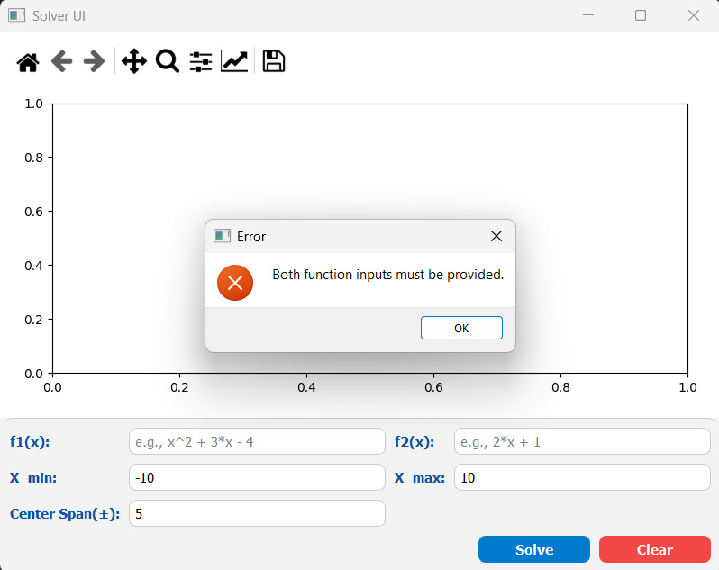

# FX Solver PySide2

A simple FX solver application built with PySide2. This application allows users to input two mathematical expressions
that are functions of x then solves for x where the two expressions are equal.

It also includes a feature to plot the two functions on a graph for visual comparison.

## Table of Contents
- [Features](#features)
- [Requirements](#requirements)
- [How to Install and Use](#how-to-install-and-use)
  - [Download](#download)
  - [Install Dependencies](#install-dependencies)
  - [Run the Application](#run-the-application)
- [Snapshots](#snapshots)
- [Demo Video](#demo-video)

## Features

- Input two mathematical expressions as functions of x.
- Solve for x where the two expressions are equal.
- Plot the two functions on a graph for visual comparison.
- User-friendly interface with error handling for invalid inputs.
- Reset functionality to clear inputs and outputs.


## Requirements


<br>

<br>

<br>


## How to Install and Use
### Directory Structure
```
fx-solver-pyside2/
│├── assets/
│   ├── snapshots/
│   └── videos/
│├── src/
│   ├── fxsolver/
│   │ ├── parser.py
│   │ └── solver.py
│   │ 
│   ├── widgets/
│   │ ├── app.py
│   │ ├── solver_ui.py
│   │ ├── plotter_widget.py
│   │ └── input_widget.py
│   └── main.py
│├── test/
│   ├── fxsolver/
│   │ ├── parser_tests.py
│   │ └── solver_tests.py
│   └── UI/
│     └── app_test.py
│├── requirements.txt
│├── .gitignore
│├── pytest.ini
│└── ReadMe.md
└── ReadMe.md
```
### Download
Clone the repository:

```sh
git clone https://github.com/AhmedBakrXI/fx-solver-pyside2.git
cd fx-solver-pyside2
```
### Install Dependencies
Install the required dependencies using pip:

```sh
pip install -r requirements.txt
```

### Run the Application
Run the application using Python:
```sh
cd src
python main.py
```

## Snapshots


<div style="text-align: center; font-style: italic">
    Welcome screen showing the main interface
</div>
<br>


<div style="text-align: center; font-style: italic">
    Valid input screen with two intersecting points
</div>
<br>


<div style="text-align: center; font-style: italic">
    Valid input screen with one intersecting point
</div>
<br>


<div style="text-align: center; font-style: italic">
    Valid input with undefined interval for solutions
</div>
<br>


<div style="text-align: center; font-style: italic">
    Welcome screen showing the main interface
</div>
<br>


<div style="text-align: center; font-style: italic">
    Test invalid characters in input
</div>
<br>


<div style="text-align: center; font-style: italic">
    Test empty input
</div>

## Demo Video
[](assets/videos/Demo.mp4)

