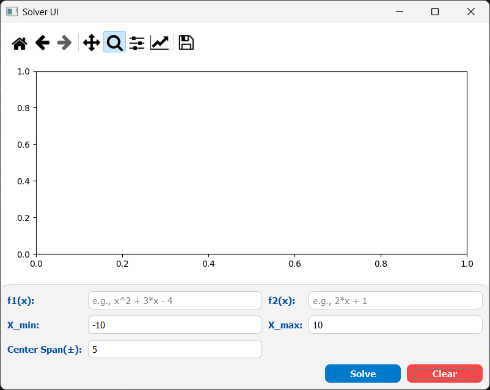
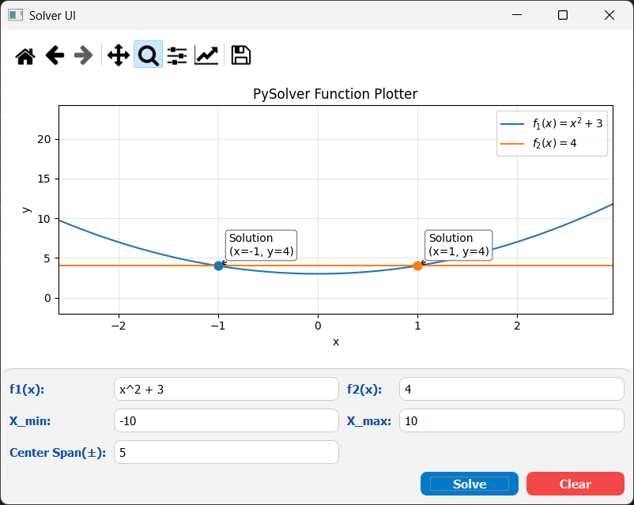
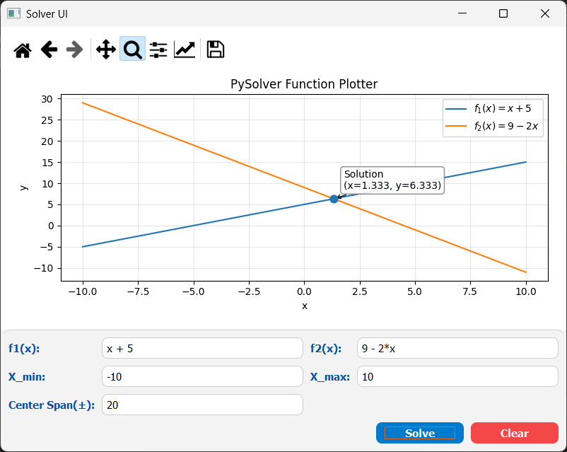
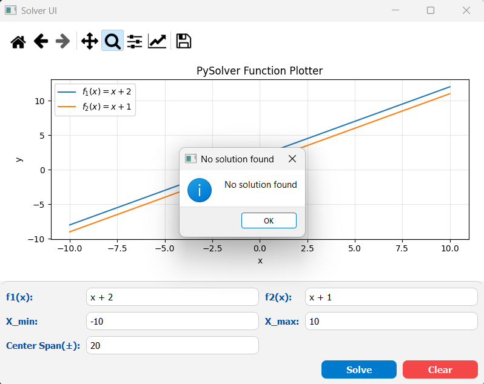
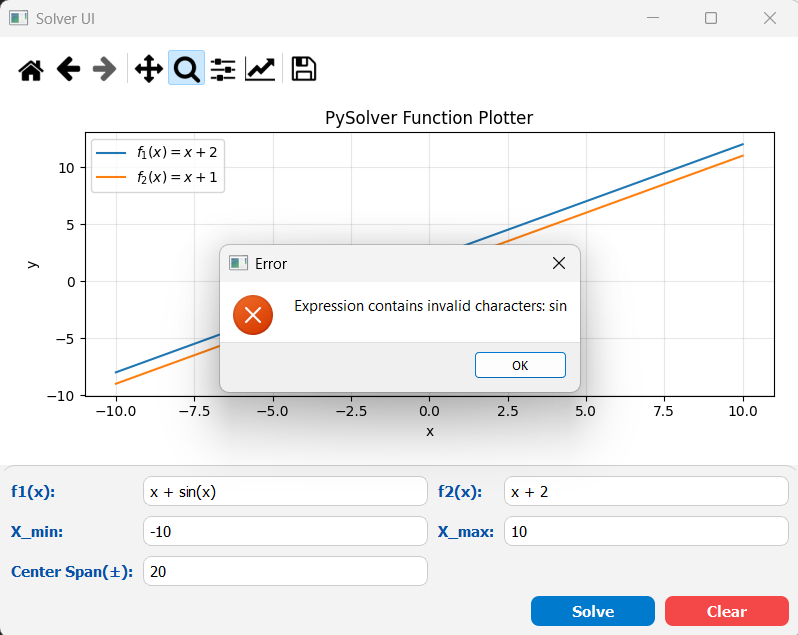
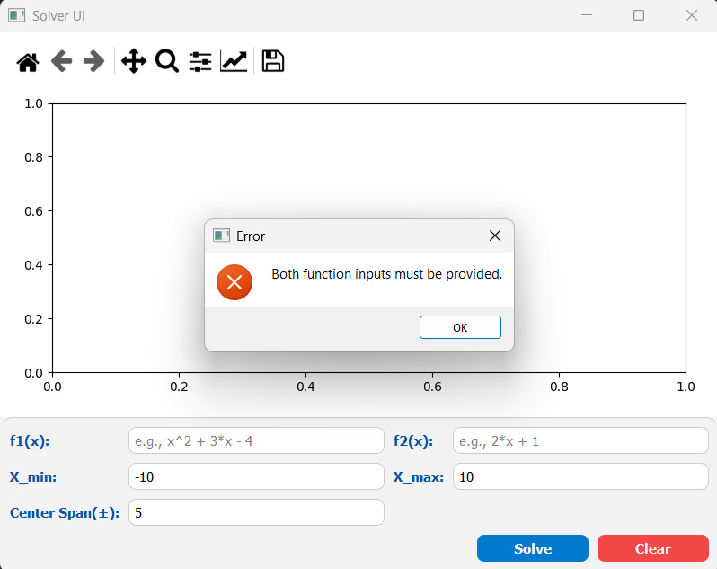

# FX Solver PySide2

A simple FX solver application built with PySide2. This application allows users to input two mathematical expressions
that are functions of x then solves for x where the two expressions are equal.

It also includes a feature to plot the two functions on a graph for visual comparison.

## Features

- Input two mathematical expressions as functions of x.
- Solve for x where the two expressions are equal.
- Plot the two functions on a graph for visual comparison.
- User-friendly interface with error handling for invalid inputs.
- Reset functionality to clear inputs and outputs.

## Requirements

## Requirements

## Requirements

 

 

 

## Snapshots

    Welcome screen showing the main interface

    Valid input screen with two intersecting points

    Valid input screen with one intersecting point

    Valid input with undefined interval for solutions

    Welcome screen showing the main interface

    Test invalid characters in input

    Test empty input

